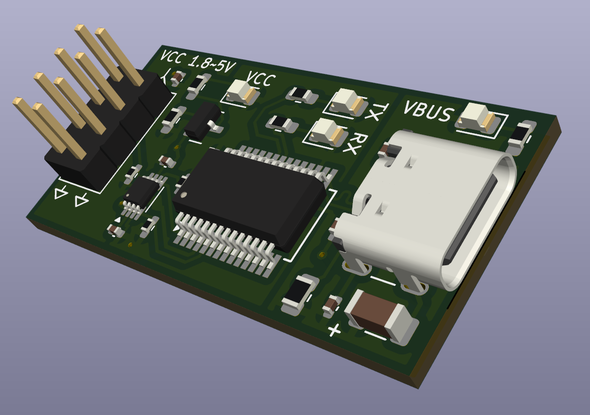

# USB-TTL Adapter with Auto Voltage Sensing

This is a simple open hardware project for a USB-to-TTL serial adapter based on the FTDI FT232RNL chip. The main feature of this adapter is its automatic voltage level detection, supporting TTL I/O levels from 1.8V to 5V without requiring manual jumper selection.

## Motivation

There are many USB-to-TTL adapters available on the market, such as:

- [AZDelivery FT232RL Adapter](https://www.amazon.it/AZDelivery-FT232RL-Adattatore-convertitore-Gratuito/dp/B01N9RZK6I)
- [DSD TECH SH-U09C2 Adapter](https://www.amazon.it/DSD-TECH-SH-U09C2-Adattatore-Programmazione/dp/B07TXVRQ7V/)

However, most of them require the user to manually set the voltage level using jumpers or switches. This can be inconvenient or even risky if the user forgets to set, or does not know exactly the correct voltage, potentially damaging the target device.

## Key Features

- Based on **FTDI FT232RNL** USB-serial bridge.
- Supports **1.8V to 5V TTL I/O levels**.
- **No jumpers or switches** required to select voltage.
- Uses **TI TXU0202** dual-channel voltage level translator for automatic level adaptation.
- Only **RX** and **TX** signals are used (no RTS/CTS or other control signals).
- Two mirrored TTL connectors with **inverted RX/TX** pinout for flexible wiring
- All schematic symbols and footprints have fields populated for **automated assembly on [JLCPCB](https://jlcpcb.com/)**

## Auto Voltage Detection

This adapter eliminates the need for manual voltage configuration. Thanks to the TXU0202 level shifter, the adapter automatically adapts to the voltage of the connected target device. This makes it safer and easier to use, especially when working with multiple devices operating at different logic levels.

## TTL Pinout

The board provides **two 1x4 pin headers** on the TTL side, with the same signals but **mirrored RX/TX orientation**. This simplifies usage with different target pinouts.

### Pinout (both connectors):

```
[ VCC_TTL | TX | RX | GND ]  ← Connector A
[ VCC_TTL | RX | TX | GND ]  ← Connector B (mirrored)
```

This layout helps avoid the common issue of crossed RX/TX lines between the adapter and the target device.

There are indications in the silkscreen to identify the VCC_TTL and GND pins.

## Manufacturing Support

This project includes files suitable for production with **[JLCPCB](https://jlcpcb.com/)**:

- [usb_uart_1V8_bom_top.csv](usb_uart_1V8_bom_top.csv) and [usb_uart_1V8_bom_bot.csv](usb_uart_1V8_bom_bot.csv): Bill of materials, with fields compatible with JLCPCB's parts selection tool (only **top** side populated)
- [usb_uart_1V8_cpl_top.csv](usb_uart_1V8_cpl_top.csv) and [usb_uart_1V8_cpl_bot.csv](usb_uart_1V8_cpl_bot.csv): Pick-and-place files (only **top** side contains components)
- All schematic symbols and footprints include **LCSC part numbers**, **JLC footprints** and assembly attributes

## Design Tools

This project was developed using **KiCad 9.0.1**.

## Repository Contents

- KiCad design files are on he root dir of the repo
- `usb_uart_1V8.pretty/`: local footprint library
- `gerber/`: Production-ready Gerber + drill files, packed in [grb_usb_uart_1V8.zip](gerber/grb_usb_uart_1V8.zip)

## Rendering

Here is a rendering of the board



## License

This project is licensed under the **CERN-OHL-S v2** open hardware license.
See [LICENSE.CERN-OHL-S_v2.txt](LICENSE) for more information.

## How to Contribute

Feel free to open issues or submit pull requests if you find bugs or want to suggest improvements.

## Acknowledgments

This project was inspired by the analysis in this blog post:
[https://www.electrothinks.com/2024/02/ft232rl-usb-to-serial-uart-module.html](https://www.electrothinks.com/2024/02/ft232rl-usb-to-serial-uart-module.html)
